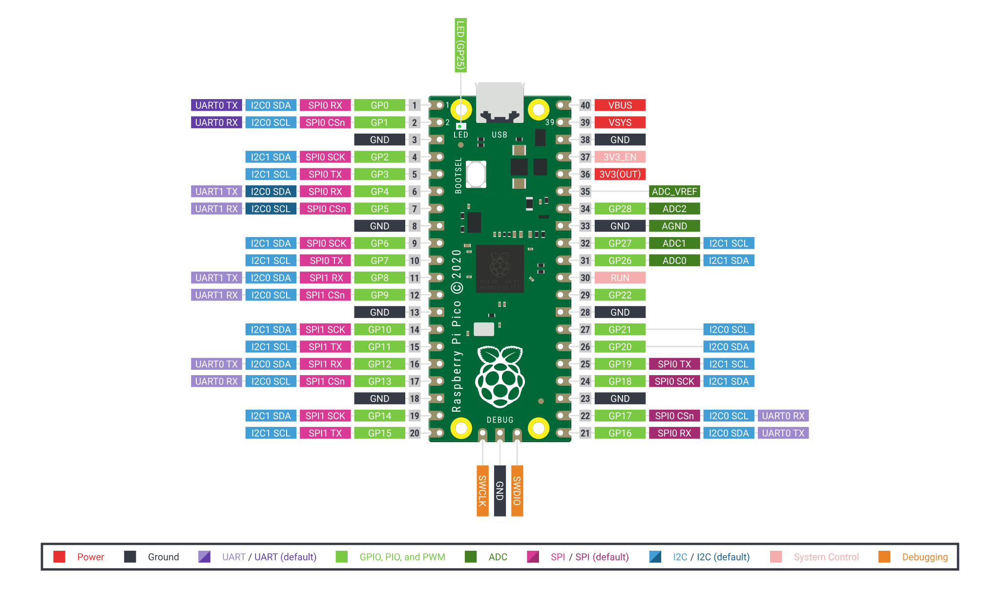

# dashlight

My car's stero annoys me, because it doesn't have a sensor which tells it when to dim the backlight, and uses the fact I've got my headlights on as the only signal.

`dashlight` leverages a [Rasberry Pi Pico](https://www.raspberrypi.com/documentation/microcontrollers/raspberry-pi-pico.html) and far too many other components to allow me to work around this. 

[According to this page](https://www.deviceplus.com/raspberry-pi/raspberry-pi-tech-vs-computers/), the Raspberry Pi Pico is four times faster than the original iPhone, so it's like using a nuclear weapon to kill an ant.

# Inputs

- Light Dependent Resistor (LDR)
- A DPST switch for either forcing the light on or off.
- A relay connected to the headlight power, to sense what state this is in, just for giggles.

# Outputs

- A GPIO drives something to replace the headlight signal to the stereo, which is the only input I can drive.

# Raspberry Pi Pico Pinout

